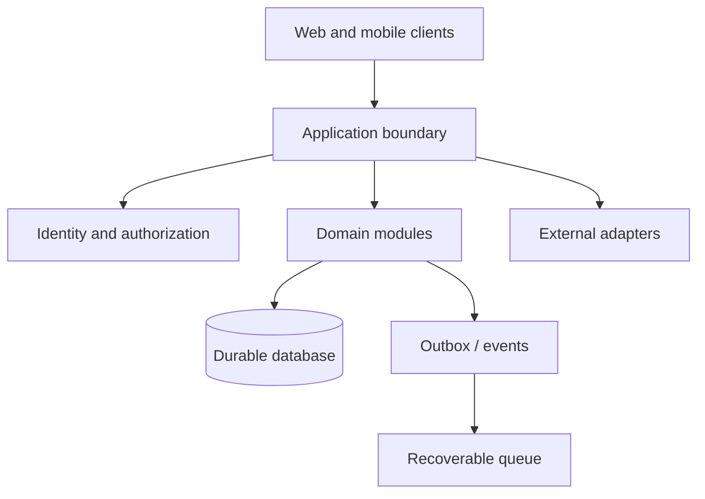

# System boundaries

The application cases use modular monoliths and adapters where a premature network boundary would complicate related transactions and operations.

## Boundary rules

- A durable database owns committed domain state; queues, caches and realtime payloads can be rebuilt or fetched again.
- An external provider does not own internal business entities.
- Authentication establishes a principal. Authorization still checks the exact resource.
- Hiding a UI control is never a substitute for server-side authorization.
- Extract a domain module into a separate service when measured scaling or operational needs justify the additional network boundary.

Examples of coupled operations include payment and product activation, inventory sale and financial income, message and delivery receipts, or ledger entry and balance/audit. A shared transaction boundary simplifies consistency and recovery in those paths.

The notification service foundation explores a separate service boundary with durable ingestion, an outbox and at-least-once semantics. Its live transport and migration have not passed production acceptance.
