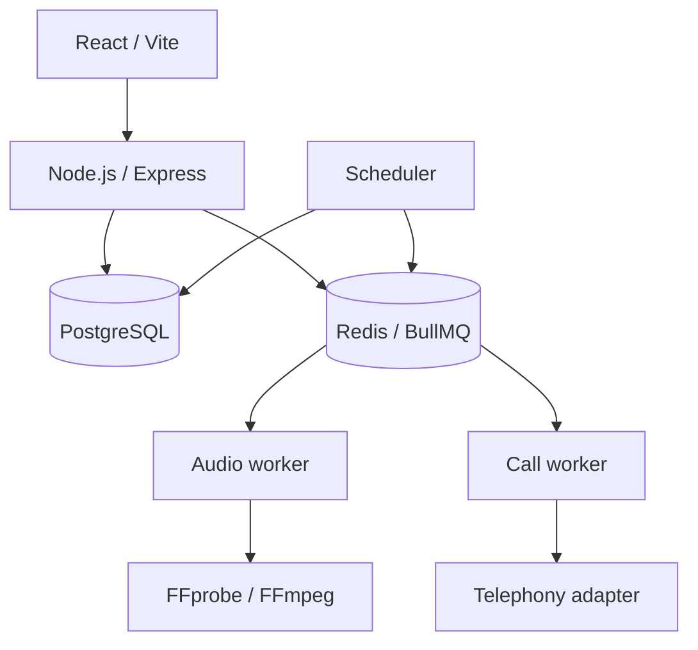

# Commercial asynchronous service — Amorie

The application is private. Provider configuration, real orders and customer data are excluded.

## Role, maturity and evidence boundary

| | |
|---|---|
| My role | Full-stack implementation, PostgreSQL schema, payment flow, background work and production deployment |
| Maturity | Order/payment flow operates in a commercial service; live telephony is off pending provider acceptance |
| Personally implemented | React UI, Node.js API, migrations, payment verification, scheduling/recovery, audio processing and security controls |
| Public evidence | Architecture, trade-offs and a runnable generalized worker path; no real provider or order data |

## Problem

The service needed to accept orders and payments for several digital products, schedule future work, process uploaded audio and recover incomplete jobs after a process or host restart.

## Constraints

- Payment callbacks can be duplicated or arrive out of order.
- Redis cannot be the only record of paid work that remains to be fulfilled.
- Filename and claimed MIME type do not establish that uploaded audio is safe or usable.
- Contact data and management capabilities need protection at rest.
- A telephony-dependent offering must remain disabled until the real provider passes acceptance.
- PostgreSQL and Redis should not be exposed directly to the production network.

## Architecture and approach

PostgreSQL owns order, payment, scheduled-call, audio and attempt state. BullMQ dispatches work. The scheduler and recovery path reconstruct missing jobs from durable records when needed.

## My implementation

- React/TypeScript client and Node.js/Express API.
- PostgreSQL schemas and checksum migrations for orders, product types, scheduled calls, audio, attempts and audit history.
- Payment creation and verification of provider state, currency, amount and order metadata before an idempotent transactional finalization.
- Explicit call/audio lifecycle states; BullMQ scheduling, workers, FFmpeg processing and retention cleanup.
- Recovery of pending/stale audio tasks and claimed calls after restart.
- Server-side upload checks, duration/format inspection and audio normalization/encoding for the provider boundary.
- AES-256-GCM for sensitive contact data; keyed hashes and timing-safe comparison for management tokens.
- Distinct development/production Compose behavior and backup, restore, deployment and rollback procedures.

## Key engineering decisions

1. **Verify payment with the provider.** A callback alone is insufficient to mark an order paid. The payment and order metadata are checked before the product transition.
2. **Make paid order finalization idempotent.** A replay returns the existing product rather than creating another one.
3. **Use a deterministic queue job ID.** The object and attempt identify the job, making recovery and retry safer.
4. **Rebuild work from PostgreSQL.** A lost queue delays fulfillment; it does not erase the obligation recorded in the database.
5. **Keep the unaccepted integration off.** A mock telephony adapter must not be mistaken for production calling.

### Trade-off: the queue executes, the database remembers

BullMQ handles concurrency and retries efficiently, but Redis contents are not proof that paid work exists. PostgreSQL stores state and attempts; reconciliation recreates missing jobs after restart. The cost is a second consistency path between database and queue. The benefit is that queue loss does not silently lose paid work.

## Reliability, security and testing

Tests cover state transitions, cryptography, scheduling, pricing calculations, repositories, routes and payment behavior. Workers use bounded concurrency, retry/backoff, deterministic IDs, heartbeats and graceful shutdown. Row locks protect payment and lifecycle transitions. Data services sit on an internal Compose network. Rollback planning includes backward-compatible schema changes and order/payment reconciliation before retries.

## Result

The commercial order/payment flow is operating. The asynchronous call subsystem has implemented durable scheduling, audio processing, recovery and provider abstraction. Live telephony has **not** passed real-provider acceptance and is not claimed as running.

## What this demonstrates

Payment and order lifecycle design; PostgreSQL as the source of truth alongside Redis/BullMQ execution; idempotency, state machines, recovery, FFmpeg, encryption and rate limiting; operational deployment and rollback thinking.

## Public artifacts

- [Reference service](../../examples/reference-service/README.md): atomic outbox write, durable worker, retry and rollback test.
- [Recoverable outbox](../../backend/recoverable-outbox.ts): queue projection pattern.
- [Compose isolation](../../devops/compose.yaml): private PostgreSQL/Redis and migration gate.
