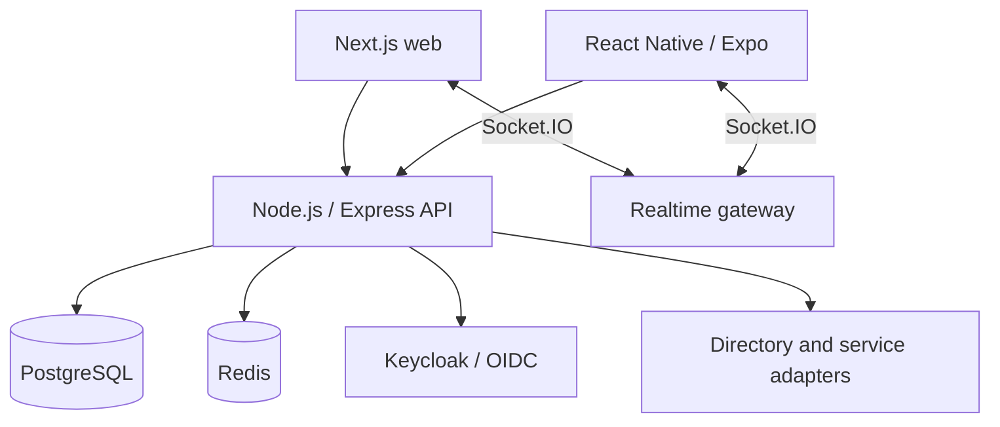

# Internal employee platform — BIC Hub

The source application is private. This case describes implementation and acceptance boundaries without publishing its employee records, endpoints or deployment topology.

## Role, maturity and evidence boundary

| | |
|---|---|
| My role | Designed and implemented backend, web/mobile clients, integrations, delivery and operational procedures |
| Maturity | Core and several modules have accepted production baselines; later CRM, HR and mobile revisions have separately documented acceptance limits |
| Personally implemented | APIs, identity mapping/RBAC, realtime flows, migrations, UI, mobile session lifecycle and CI/CD described below |
| Public evidence | Architecture and maturity account, runnable reconstruction, focused samples and CI; private production code and runtime records remain unavailable |

## Problem

Employees needed one authenticated workspace for directory and profiles, messaging, tasks, Service Desk, notifications, onboarding, infrastructure self-service and a configurable desktop CRM. Web and Android clients had to share identity and API behavior while shipping through a controlled path to production.

## Constraints

- Existing directory, identity, file and VPN products retained ownership of their respective data.
- UI visibility could not replace server authorization.
- Web, mobile, background notifications and realtime needed consistent user and delivery/read semantics.
- Schema changes had to work against an installed system, with staging and production identities, storage and mobile artifacts separated.
- The public case cannot disclose original source, employee data or exact topology.

## Architecture and approach

The backend is a modular monolith with shared principal resolution, authorization, migrations, notifications and realtime infrastructure. Closely related modules retain a shared deployment and transaction boundary; external products are integrated through adapters, not claimed as custom-built components.

## My implementation

- Node.js/Express REST services backed by PostgreSQL and Redis; Keycloak/OIDC identity mapping into an application principal and resource-level permission checks.
- Authenticated Socket.IO messaging, user/conversation rooms, delivery/read updates, presence and reconnect behavior.
- Next.js/React workspaces and React Native/Expo workflows using shared API contracts.
- Mobile Authorization Code + PKCE, secure token storage, coordinated refresh and session-aware socket lifecycle.
- Ordered SQL migrations with checksums, PostgreSQL advisory lock and clean-schema CI checks.
- CRM pipelines, stages, deals, activities, configurable fields, permission-aware views, Kanban and optimistic UI.
- Separate Compose-based staging/production configurations, Nginx routing, GitHub Actions, Playwright checks and release acceptance records.

## Key engineering decisions

1. **Authenticate, then authorize.** A valid identity-provider token is mapped to a principal and an eligible employee record before resource access is evaluated.
2. **Build realtime payloads per recipient.** A message event triggers a recipient-specific read rather than broadcasting a single object with fields the recipient should not see.
3. **Make migration history immutable.** A stored checksum rejects altered applied SQL; an advisory lock serializes competing migrations.
4. **Track source acceptance separately from runtime acceptance.** A merged revision is not evidence that it was deployed or accepted by users.
5. **Bind the mobile socket to app and token state.** Sign-out, offline and background transitions disconnect it; a changed token replaces the connection.

### A failure found in runtime testing

An early mobile implementation cleared the session after any token-refresh failure. A transient network failure therefore forced a logout. The fix distinguishes terminal OAuth errors (`invalid_grant`, `invalid_token`) from network failures and clears secure storage only for terminal errors. A test verifies that a transient refresh failure preserves the refresh token. This change is part of the accepted mobile runtime baseline.

## Reliability, security and testing

- CI scans for common credential signatures and disallowed environment/build artifacts.
- Migrations run twice against clean PostgreSQL to check installation and repeatability.
- Backend tests cover authentication, messaging, tasks, Service Desk, notifications, mobile API and migrations. Playwright exercises key web workflows.
- Mobile CI performs lint, typecheck, tests, config validation and Android export.
- A release is tied to an exact Git commit and a mobile artifact checksum.

## Result

The platform has accepted production baselines for its shared core, employee directory, messenger, Service Desk, notifications, onboarding, cloud entry and VPN flows. CRM and later HR/mobile revisions have stronger source and CI evidence than independent runtime acceptance evidence for each subsequent change.

## What this demonstrates

Full-stack and mobile delivery in one product; Node.js/Express, React/Next.js, React Native/Expo, PostgreSQL, Redis and Socket.IO; OIDC/PKCE and server-side RBAC; migration design, CI and explicit release evidence levels.

## Public artifacts

- [Runnable reference service](../../examples/reference-service/README.md): PostgreSQL migrations, exact-space permissions and integration tests in a new domain.
- [Migration runner](../../database/checksummed-migrations.ts): checksum history and advisory lock.
- [Mobile session manager](../../mobile/pkce-session-manager.ts): terminal versus transient refresh errors.
- [CI workflow](../../.github/workflows/validate.yml): build, migrations and integration tests for the public reconstruction.
