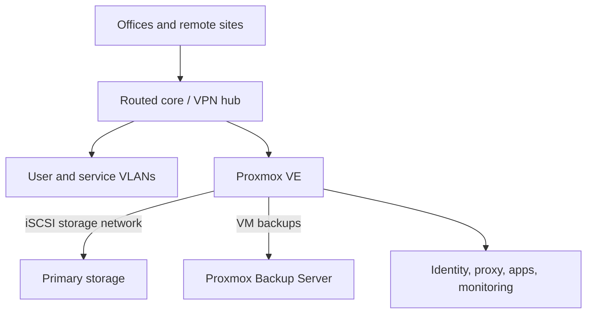

# Infrastructure, backup and disaster recovery

All sites, addresses, hosts, inventory, capacities and exact topology are removed. The diagrams describe boundaries, not the private network.

## Role, maturity and evidence boundary

| | |
|---|---|
| My role | Designed, deployed and operated networking, virtualization/storage, backup and operational documentation |
| Maturity | Production infrastructure; public artifacts intentionally omit exact configuration and inventory |
| Personally implemented | VLAN/routing/VPN, Proxmox VE/PBS, TrueNAS/iSCSI, monitoring, restore drill and change/incident procedures |
| Public evidence | Sanitized restore runbook and incident analysis; original commands, IPs, VM IDs and capacities excluded |

## Problem

A growing multi-site environment needed coherent networking, virtualization, storage, identity, monitoring, verified backups and documentation usable during an incident.

## Constraints

- Legacy dependencies and single points of failure already existed.
- VM storage crossed compute and storage layers over iSCSI.
- Backup infrastructure served additional operational purposes.
- Remote changes required a fallback access path and predetermined rollback.
- Missing information could not be silently converted into assumed guarantees.

## Architecture and approach

User, server, management, guest, voice, CCTV and storage/backup traffic have separate boundaries. Documentation connects architecture, inventory references, runbooks, troubleshooting, change records and technical debt; secrets and device exports stay out of Git.

## My implementation

- Server/physical environment, switching, routing, VLANs, firewall/NAT, Wi-Fi separation and site-to-site VPN.
- Proxmox VE/PBS, TrueNAS/iSCSI, Active Directory/DNS, Linux services, containers and monitoring.
- Backup retention and verification plus an isolated end-to-end VM restore drill.
- Dependency-ordered disaster recovery across network, storage, compute, identity and applications.
- Change cards with prechecks, success criteria, rollback triggers, postchecks and documentation updates.
- Incident severity and first response, evidence preservation, recovery checks and follow-up.
- Cross-layer investigation of storage degradation across hypervisor, iSCSI, ZFS, kernel memory, switching and affected services.

## Key engineering decisions

1. **A running VM does not imply healthy storage.** Guest I/O, kernel timeouts and application paths must be measured independently.
2. **Restore in isolation first.** Assign a new temporary identity and disconnect networking before booting a restored VM.
3. **Order recovery by dependencies.** Network and storage precede VMs; identity/DNS and databases precede dependent apps.
4. **Record uncertainty.** Missing RPO/RTO, backup scope and restore evidence are tracked gaps, not implied guarantees.
5. **Prefer one reversible change during diagnosis.** Multiple simultaneous changes obscure cause and rollback.

### A real incident and corrective change

Several VMs remained `running` while guest I/O stalled. A healthy ZFS pool and established iSCSI session did not explain the failure. SCST allocation errors aligned with initiator timeouts, locating the immediate failure in the target request path. One reversible ARC cache limit preserved kernel/SCST memory headroom. Verification showed the effective limit, increased available memory, no new allocation errors during the observation window and recovered dependent paths. The ultimate cause of kernel allocation failures could not be proven retrospectively because a memory snapshot at incident onset was unavailable.

## Reliability, security and testing

Backup review covers job outcome, retention, datastore capacity and planned verification. The restore drill follows the backup job through snapshot read, disks/config restoration, isolated boot and guest activity. An infrastructure restore does **not** establish database/application consistency; workload-specific checks remain necessary. Procedures distinguish read-only from configuration-changing commands and exclude sensitive exports.

## Result

The environment gained an operational source of truth, repeatable change/incident procedures and an infrastructure-level verified restore chain. Remaining single points of failure and unproven recovery boundaries are visible for prioritization.

## What this demonstrates

Linux production operations, network segmentation and VPN, Proxmox/TrueNAS/iSCSI storage, backup and DR, cross-layer incident diagnosis and evidence-based runbook/change management.

## Public artifacts

- [Isolated VM restore runbook](../../infrastructure/backup-restore-runbook.md): sequence, stop conditions and evidence record.
- [Storage incident analysis](../../infrastructure/incident-analysis.md): evidence chain, corrective action and diagnostic limits.
