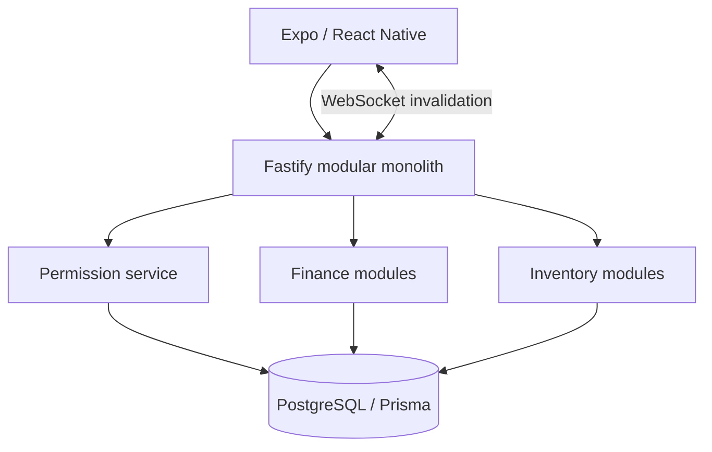

# Multi-tenant finance and inventory — Monedo

This is a private personal product. User financial records and deployment secrets are not published.

## Role, maturity and evidence boundary

| | |
|---|---|
| My role | Designed and implemented the TypeScript monorepo, Fastify API, Prisma/PostgreSQL model and React Native/Expo client |
| Maturity | Released alpha baseline; inventory/production work continued in later feature revisions, not a mature production service |
| Personally implemented | Data models, permission service, atomic finance/inventory operations, sessions, invalidation and mobile flows |
| Public evidence | Architecture, focused ledger and invalidation samples, runnable tenant/idempotency path in an unrelated domain |

## Problem

One application needed personal, shared and small-business finances without weakening tenant isolation or money correctness. Later business functionality added catalog, locations, production, transfers, sales, write-offs and a sale-to-income link.

## Constraints

- Monetary values cannot rely on binary floating point.
- Membership in one `Space` cannot grant access to another.
- Balances and transaction history must move together.
- A retried mutation must not duplicate a ledger entry.
- Stock must follow a movement ledger rather than an editable number.
- Mobile realtime events cannot become a second source of truth.

## Architecture and approach

A pnpm/Turborepo monorepo contains the Fastify API, Prisma/PostgreSQL layer, Expo app and shared TypeScript contracts. The modular monolith keeps related transaction boundaries local while separating domain responsibilities.

## My implementation

- Models for tenants, spaces, memberships, invitations, accounts, entries, planning, audit, exports, inventory and production.
- Backend permission checks for the specific requested space, independent of client state.
- Integer minor units (`BIGINT`) for money, serialized as strings at the JSON boundary.
- A Prisma transaction covering entry validation, balance changes, splits, audit and idempotency.
- Inventory documents and immutable movements, including lot-aware allocation and the link from physical sale to income.
- JWT access tokens, opaque refresh sessions with hashing/rotation, hashed invitations and structured-log redaction.
- Authenticated WebSocket events that invalidate TanStack Query data and trigger an authorized API refetch.
- Expo workflows for finance, analytics, spaces, members, exports and inventory.

## Key engineering decisions

1. **Space is the permission boundary.** A top-level family/tenant membership does not grant all child-space access.
2. **Commit ledger and balance together.** Entry, splits, balance deltas, audit and idempotency record share one database transaction.
3. **Derive stock from movements.** Posted documents create signed immutable movements; drafts do not alter stock.
4. **Send invalidation, then refetch.** Realtime carries the change signal, while authorized HTTP queries return the current state.
5. **Consume invitations atomically.** A one-time code is revealed once, stored as a hash, expires and cannot be replayed.

### Trade-off: a wider tenant role would be easier, but unsafe

Checking only the parent family membership would simplify permission logic while letting access to one shared area reach another. The permission service queries active membership for the exact `spaceId` from the request. The private multi-user/outsider suite exercises permission and IDOR paths; the [public reference service](../../examples/reference-service/README.md) reproduces the exact-space rule with fictional data.

## Reliability, security and testing

CI runs Prisma validation/deploy, lint, typecheck, unit tests, build and PostgreSQL checks. Integration/E2E scenarios exercise multiple users, invitation replay/expiry/revocation, permissions and IDOR, transfers, budgets, analytics, multiple currencies and export security. Constraints and foreign keys guard document state, locations, quantities and financial links. Upload endpoints remain disabled until file-signature validation and a safe storage adapter exist.

## Result

The released alpha covers shared-finance functionality. Later feature work implements inventory/production with an atomic financial link. Roadmap items and feature revisions are not presented as a mature production deployment.

## What this demonstrates

TypeScript/Fastify/Prisma/PostgreSQL/Expo, exact tenant authorization, finance/inventory domain modeling, atomic operations, security testing and WebSocket-driven cache invalidation.

## Public artifacts

- [Reference service](../../examples/reference-service/README.md): runnable exact-space boundary, idempotency and PostgreSQL tests.
- [Atomic ledger](../../database/atomic-ledger.ts): balance, audit and idempotency in a transaction-shaped sample.
- [Realtime invalidation](../../mobile/realtime-invalidation.ts): cache invalidation with API as source of truth.
