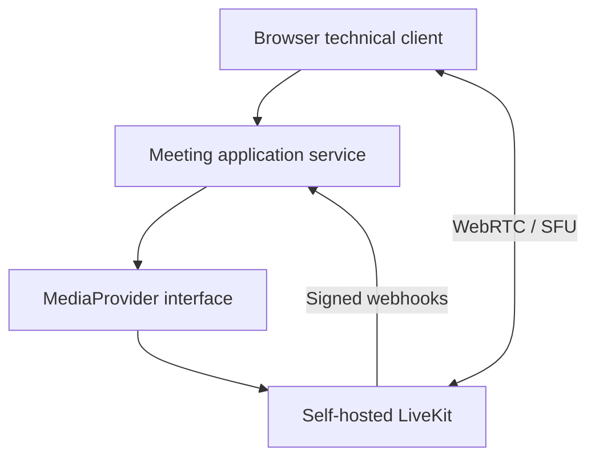

# Self-hosted realtime meetings — LAN prototype

**Maturity: tested LAN technical prototype.** This is not an accepted production videoconferencing service.

## Problem

An internal communications platform needed to test self-hosted audio/video meetings that could function on a LAN without WAN availability, while keeping application meeting entities separate from the media provider's objects.

## Constraints

- Media transport has different network requirements from HTTP behind a reverse proxy.
- The initial single-node deployment needed a small, understandable operational footprint.
- A browser grant cannot expose the media provider's API secret.
- Presence must follow trusted provider events, not token issuance or client assertions.
- Available acceptance equipment did not establish trusted HTTPS/WSS microphone/camera behavior.

## Architecture and approach

The application owns meeting and participant lifecycle. LiveKit supplies SFU/media functions behind an adapter that creates rooms, issues short-lived single-room grants and verifies signed presence webhooks.

## My implementation

- Repeatable Docker Compose baseline for LiveKit and a TypeScript technical client/token service.
- Provider abstraction and meeting lifecycle: create, start, add participant, grant access, record join/leave and end.
- Verified webhook handling for participant joined/left/connection-aborted events.
- Validation, rate limiting, tests, CI, diagnostics, health checks and networking/security/rollback documentation.
- LAN acceptance for media-less clients, multiple participants, inter-VLAN transport, direct UDP and new rooms with WAN unavailable.

## Key engineering decisions

1. Token issuance does not count as presence; a verified provider event does.
2. Application UUIDs and lifecycle remain independent of LiveKit identifiers.
3. Redis was deferred for the single-node phase because it added an operational dependency without changing the shared failure domain.
4. TURN and external exposure require separate design; managed-LAN tests used direct SFU transport.

## Reliability, security and testing

The browser receives a short-lived participant grant while API secrets remain server-side. Automated tests cover service transitions, validation, the media adapter and HTTP behavior; CI checks TypeScript, build and Compose. A single-node restart loses transient meetings. Trusted HTTPS/WSS, live mic/camera, media controls and A/V reconnect did **not** pass acceptance.

## Result

The prototype established LAN signaling/transport, a provider boundary, application lifecycle and a trusted presence mechanism, along with an explicit list of blockers before production integration.

## What this demonstrates

LiveKit/WebRTC/SFU boundaries, network-aware TypeScript application design and disciplined runtime acceptance without claiming completed external A/V delivery.
