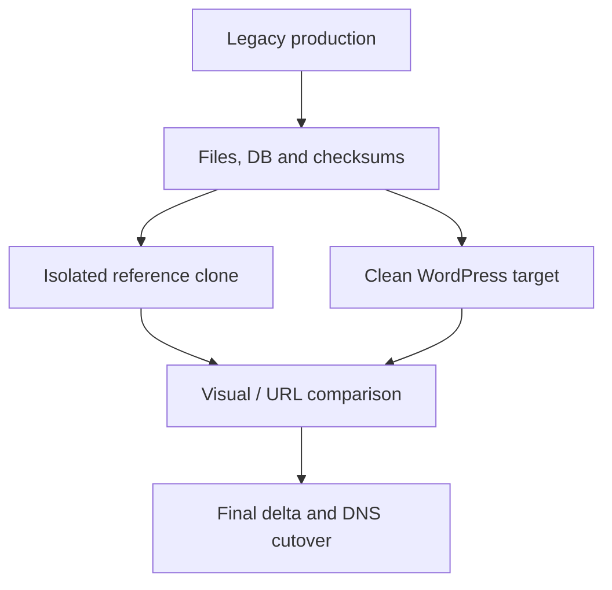

# WordPress migration platform — pilot

This case draws on a private operational repository. Domains, hosts, paths, credentials and client content are removed.

## Problem

Legacy sites on different hosts and old CMS stacks needed a repeatable WordPress migration platform that preserved content and URLs without importing unsupported runtime dependencies.

## Constraints

- Live sites remained authoritative until cutover.
- Some sources depended on old PHP, themes/builders or multi-site coupling.
- Discovery and snapshots could not modify production.
- Visual reconstruction had to follow observed source content and behavior.
- Each target needed its own runtime, database, backup and rollback path.

## Architecture and approach

Each target uses a separate Compose project, MariaDB, webroot and loopback-bound backend behind Nginx. Legacy clones are isolated references for comparison, never the intended target runtime.

## My implementation

- Hosting, DNS, CMS, database and file-source audit with an explicit evidence hierarchy.
- Canonical snapshots with database dumps, files, metadata and checksums.
- Isolated legacy reference runtime where visual comparison required it.
- Clean WordPress/PHP/MariaDB targets and custom themes, without old core/theme/plugin stacks.
- Media migration and legacy ID mapping where needed; URL structure and content templates based on source evidence.
- Final snapshot/delta rules, smoke checks, rollback points and DNS cutover procedure.

## Key engineering decisions

The reference clone is a temporary comparison tool. Content, URLs, media and rendered behavior are separated from legacy implementation. Site isolation removes coupling. A historical snapshot establishes a starting point; a fresh production delta is still required before DNS cutover.

## Reliability, security and testing

Snapshots use checksums. A clean rollback point precedes content transfer. Acceptance covers PHP syntax, assets, URL status, visual behavior, forms and SEO redirects. Access secrets stay in a vault; backend services bind to loopback and are exposed through the reverse proxy.

## Result

The pilot produced a working clean WordPress runtime, migrated media and URL structure, reconstructed key pages from verified source material and a reusable migration method. **Final cutover remains pending** visual acceptance and a fresh production delta.

## What this demonstrates

Linux, Nginx, PHP, MariaDB, WordPress and Compose; staging, legacy migration, evidence collection, rollback and planned DNS cutover.
