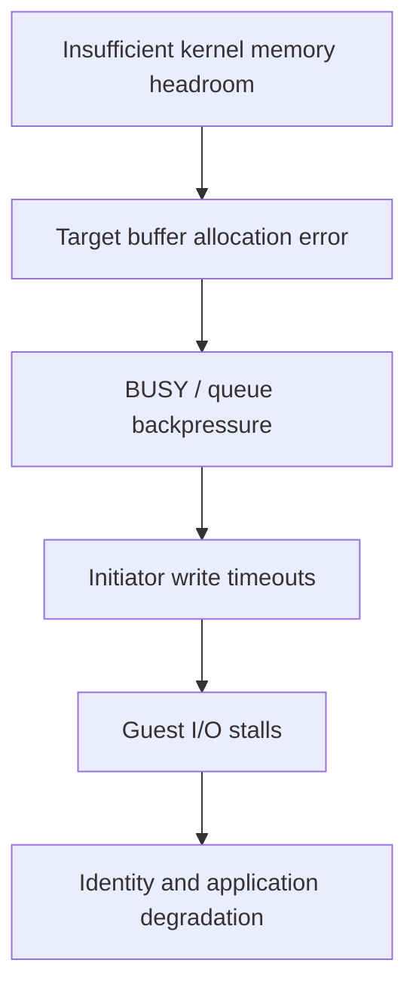

# Storage incident: a healthy pool with stalled guest I/O

This analysis is sanitized. No host, VM, capacity, timeline or network identifiers from the production environment are included.

## Observed failure

Several VMs stopped responding while the hypervisor still showed them running, the iSCSI session stayed established and the storage pool appeared healthy. Correlating target allocation errors with initiator write timeouts placed the immediate failure in the storage request path.

The diagram shows the supported mechanism and a plausible risk factor. It does not claim that the ultimate cause of the initial allocation failure was proven.

## Evidence considered

- Timestamps of hypervisor kernel I/O timeouts and target allocation errors.
- Storage pool and controller logs; physical link/optics counters and dropped/error frames.
- iSCSI session continuity; kernel memory, slab, cache limits and available headroom.
- Failures in dependent identity and application paths.

## Diagnosis and limit

A healthy pool ruled out a simple pool failure but did not establish target-service health. Clean physical link counters reduced the likelihood of a link-layer cause. Target allocation failures aligned in time with initiator timeouts, establishing the immediate failure mechanism.

The exact initial reason for kernel allocation failure could not be reconstructed: a memory snapshot at incident onset was unavailable. An automatically sized filesystem cache leaving little kernel/target headroom was the strongest supported risk factor.

## Corrective change

A persistent upper cache limit was applied through the platform-supported mechanism to reserve explicit memory headroom. Target thread count, swap, network, firmware and storage layout were not changed simultaneously; this kept the action reversible and the result interpretable.

## Verification

- The effective cache limit changed and available memory increased.
- No new target allocation errors appeared in the observation window.
- Dependent storage/application paths recovered.
- Monitoring targets now include allocation errors, memory headroom, cache size and initiator timeouts.

“Pool healthy”, “session connected” and “VM running” each describe one layer. They do not prove that a storage service can still process requests.
